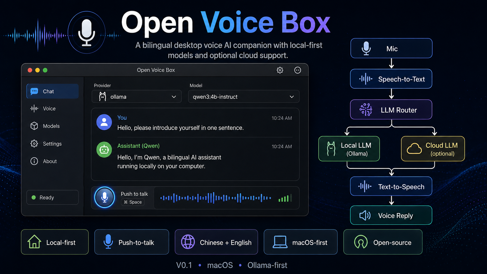

# Open Voice Box

A local-first bilingual voice AI companion for macOS. Press a button, speak in Chinese or English, and hear the AI answer aloud.



> **V0.2:** macOS-first, push-to-talk, Ollama-first, with a reproducible unsigned `.app` build for Apple Silicon.

## What it does

Open Voice Box turns your Mac into a simple desktop voice AI companion:

1. Press **Speak** and talk in Chinese or English.
2. `faster-whisper` transcribes your speech locally.
3. The request is sent to a local Ollama model by default, or optionally to OpenAI.
4. The answer appears in the app and is spoken aloud with macOS text-to-speech.

## Why Open Voice Box?

- **Local-first:** Ollama is the default; no paid API key is required.
- **Bilingual:** local speech recognition auto-detects Chinese and English.
- **Voice in, voice out:** microphone input, visible answers, and audible replies.
- **Optional cloud mode:** switch to OpenAI through environment configuration.
- **Extensible:** provider, STT, recorder, and TTS layers are isolated for future hardware work.
- **Open source:** built in public with reproducible setup, tests, issues, and release milestones.

## V0.1

V0.1 is the first working prototype. It has been validated on an Apple Silicon Mac with real Chinese and English voice turns, including microphone permission handling, missing Ollama/model recovery, and temporary audio cleanup.

Wake words, persistent memory, Raspberry Pi, ESP32, camera, and animated faces are intentionally deferred to later iterations.

## macOS app build (v0.2)

V0.2 can be packaged as an unsigned Apple Silicon macOS application. Ollama remains an external prerequisite and the faster-whisper model is downloaded on first speech use.

### Prerequisites

- Apple Silicon Mac
- Ollama installed and running
- Default local model pulled with `ollama pull qwen3:4b-instruct`
- Python 3.11+ is required to build the `.app`, but not to launch the finished bundle

### Build

```bash
git clone https://github.com/jonasnick629182-blip/open-voice-box.git
cd open-voice-box
python3 -m venv .venv
source .venv/bin/activate
python -m pip install -e '.[dev,packaging]'
bash scripts/build_macos_app.sh
```

The generated application is:

```text
dist/Open Voice Box.app
```

Open it from Finder or run:

```bash
open "dist/Open Voice Box.app"
```

### Unsigned app / Gatekeeper

V0.2 is not signed or notarized. On first launch, macOS may block the app. In Finder, Control-click **Open Voice Box.app**, choose **Open**, and confirm the prompt. Do not disable Gatekeeper globally.

### Microphone permission

The app declares its microphone usage purpose in its macOS bundle. When prompted, allow **Open Voice Box** under **System Settings → Privacy & Security → Microphone**.

## Quick start from source

### 1. Install prerequisites

Install Python 3.11 or newer and Ollama.

### 2. Pull the default local model

```bash
ollama pull qwen3:4b-instruct
```

### 3. Clone and install

```bash
git clone https://github.com/jonasnick629182-blip/open-voice-box.git
cd open-voice-box
python3 -m venv .venv
source .venv/bin/activate
python -m pip install -e .
```

### 4. Run

```bash
python -m open_voice_box
```

On the first speech transcription, the Whisper model may need to download once.

## Optional OpenAI mode

```bash
cp .env.example .env
```

Set:

```dotenv
OVB_PROVIDER=openai
OPENAI_API_KEY=your_key_here
OVB_OPENAI_MODEL=gpt-5-mini
```

Never commit `.env`.

The **Model settings** panel in the app can switch between Ollama and OpenAI and change the active model name at runtime. OpenAI mode still requires `OPENAI_API_KEY` in the environment or `.env`.

## Configuration

| Variable | Default | Purpose |
| --- | --- | --- |
| `OVB_PROVIDER` | `ollama` | `ollama` or `openai` |
| `OVB_OLLAMA_URL` | `http://localhost:11434` | Local Ollama URL |
| `OVB_OLLAMA_MODEL` | `qwen3:4b-instruct` | Local model |
| `OVB_OPENAI_MODEL` | `gpt-5-mini` | Optional cloud model |
| `OVB_STT_MODEL` | `small` | faster-whisper model |
| `OVB_TTS_VOICE` | empty | Optional macOS `say` voice |

## Troubleshooting

### Microphone permission

For the packaged v0.2 app, allow **Open Voice Box** in macOS **System Settings → Privacy & Security → Microphone**. When running from source, permission may instead appear under the terminal/Python application used to start it.

### Ollama is not reachable

Start Ollama, then verify the model exists:

```bash
ollama list
ollama pull qwen3:4b-instruct
```

### Speech model first-run download

The local speech model is downloaded on first use. Retry with a working internet connection, then subsequent use is local.

## Tests

```bash
python -m pip install -e '.[dev]'
python -m pytest -q
```

Packaging smoke build on macOS:

```bash
python -m pip install -e '.[dev,packaging]'
bash scripts/build_macos_app.sh
python scripts/verify_macos_bundle.py "dist/Open Voice Box.app"
```

## Roadmap

Active roadmap issues:

- [#2 — Wake-word activation for hands-free conversations](https://github.com/jonasnick629182-blip/open-voice-box/issues/2)
- [#3 — Improve live transcription, VAD, and silence handling](https://github.com/jonasnick629182-blip/open-voice-box/issues/3)
- [#4 — Package Open Voice Box as a standalone macOS app](https://github.com/jonasnick629182-blip/open-voice-box/issues/4)

Longer-term ideas:

- Better multilingual/local TTS
- Persistent opt-in memory
- Linux / Raspberry Pi validation
- ESP32 controls
- Screen / animated face
- Skills and home automation

## Contributing

See `CONTRIBUTING.md`.

## License

MIT
